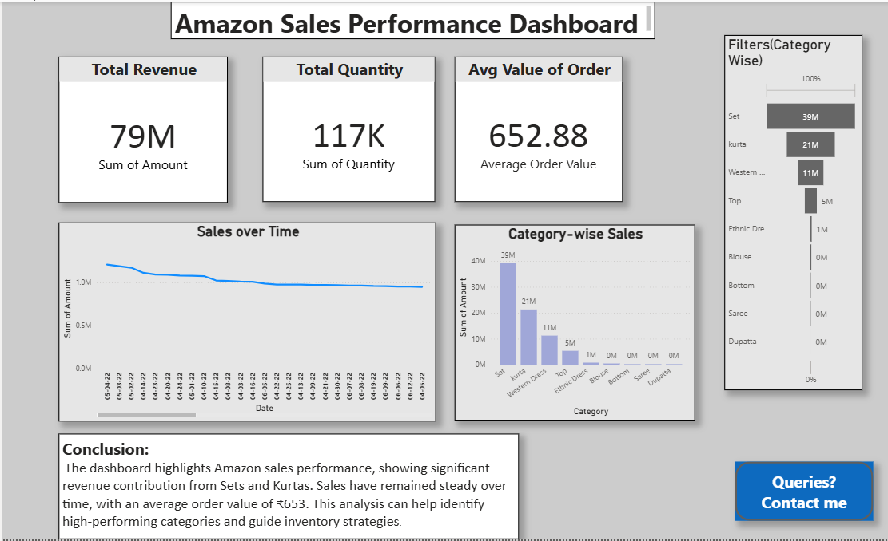

# E-commerce Business Intelligence Dashboard

This project is an interactive **Power BI dashboard** designed to analyze e-commerce sales performance.  
It provides insights into **Revenue, Profit Margin, Customer Retention, Quantity Sold, and Average Order Value**, along with category trends and time-series analysis.

## 📊 Features
- KPI cards for sales metrics (Revenue, Profit Margin, Customer Retention, etc.)
- Category-wise analysis with filters
- Sales trend over time
- Interactive slicers & drill-downs
- Conclusion summary

## 🛠 Tools & Technologies
- Power BI
- Power Query
- DAX
- Data Cleaning & EDA

## 📷 Dashboard Preview

## 📂 How to Use
- Download the `.pbix` file from this repository.
- Open in Power BI Desktop.
- Explore the interactive dashboard.
